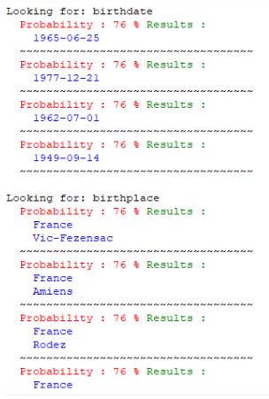
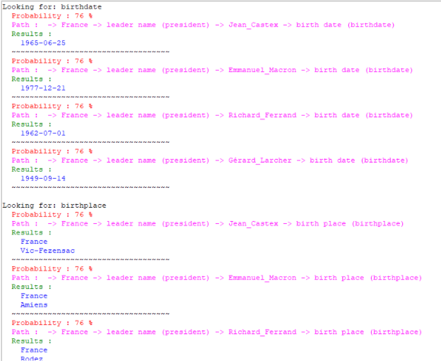
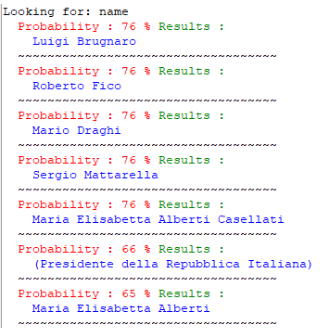
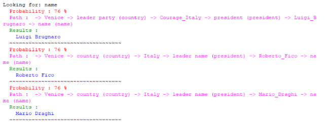

# Projet TATIA 
## *Fissore Davide* & *Antoine Venturelli*
### M1 Informatique, année 2021-2022

> But du projet : réalisation d’un répondeur de question en s’appuyant sur la base de données structurée DBPedia

  - [Panoramique](#panoramique)
  - [Lancement du Projet](#lancement-du-projet)
  - [Répartition des tâches](#répartition-des-tâches)
  - [Fichiers caractérisant le projet](#fichiers-caractérisant-le-projet)
  - [Fonctionnement du code](#fonctionnement-du-code)
    - [Analyse de la question](#analyse-de-la-question)
    - [Les query](#les-query)
    - [Le main](#le-main)
  - [Exemple de résultats](#exemple-de-résultats)
    - [Question : “What is the birthdate and the birthplace of the president of France ?”](#question--what-is-the-birthdate-and-the-birthplace-of-the-president-of-france-)
    - [Question : "What is the name of the president of the country with Venice ?"](#question--what-is-the-name-of-the-president-of-the-country-with-venice-)
  - [Conclusions](#conclusions)


## Panoramique
Langage utilisé **Python** version 3.9.7 avec les librairies suivantes :
- *JSON* pour un affichage plus propre des structures comme les dict, les listes, les sets de Python
- *gensim* pour la vectorisation des mots
- *nltk* pour la stemmatisation des mots et charger le corpus brown
- *bs4* pour le parsing des pages HTML
- *requests* pour envoyer des requêtes https
- *SPARQLWrapper* pour interroger DBPedia
- *tkinter* pour l’affichage de l’interface graphique

## Lancement du Projet

Pour exécuter le projet, il faut se placer dans la racine du projet depuis le terminal et lancer le fichier *main.py*. La fenêtre graphique s’ouvrira après quelques instants pour que les bibliothèques importées se chargent (ça prend un peu de temps le load de gensim et du fichier brown.embedding, si ce dernier n’existe pas il sera créé pour accélérer le prochain lancement du main).

On peut ajouter en ligne de commande le paramètre optionnel *“-shell”* pour pouvoir lancer le *main* sans interface graphique.

## Répartition des tâches

Le projet a été réalisé pendant le premier semestre du -M1 Informatique* de *l’Université Côte d’Azur* année 2021-2022 par les étudiants Fissore Davide et Antoine Venturelli. 

Nous avons travaillé principalement ensemble tout au long du projet en nous rencontrant dans les salles mises à disposition de l’université pour pouvoir échanger les idées et essayer de résoudre les problèmes que nous pouvions rencontrer pendant la phase de codage.

En particulier Antoine s’est occupé du parsing de la question avec le but d’y extraire les entités caractérisant la query à poser à la base de données grâce au site dictionary.com et Davide a créé les algo pour le parcours de l’arbre de DBPedia en ne gardant que les réponses les plus probablement correctes à la question de départ avec la vectorisation et lemmatisation des mots.

## Fichiers caractérisant le projet

Le code est composé de 3 fichiers chacun ayant un rôle spécifique : 
- read_input.py → parsing de la phrase 
- query_class.py → parcours de l’arbre DBPedia
- main.py → répondre à la question en entrée

## Fonctionnement du code

Comme dit précédemment, le projet peut être divisé en deux grosses sous-parties : l’analyse de la question et la recherche de l’information.

### Analyse de la question

La première étape du projet a été celle qui vise à apprendre au programme quels sont les mots de la question à considérer pour l'envoi de la requête. Comme on a vu en cours, nous avons réalisé que cette tâche n’est pas évidente : malheureusement il n’y a aucune règle fixe qui puisse être utilisée.

On a alors décidé de simplifier le traitement de la question en ne considérant que les “noms” (ou les “abréviations”) en disant que c’est à partir d’eux que la query peut être construite. Par exemple, dans la question :

**[Q1] “Who is the president of France ?”**

Nous faisons un premier pré-traitement en effaçant tout caractère non connu, c’est-à-dire tout caractère qui n’appartient pas à l’ensemble “[A-Za-z_-]” où les tirets sont bien pris en compte. 

Ensuite, on interroge le dictionnaire du site dictionary.com qui nous permet de savoir que les seuls “noms” de la Q1 sont *president* et *France*.

Il existe par contre des question plus complexes comme les questions suivantes :

**[Q2] “What is the birthdate of the president of France ?”**   
**[Q3] “What is the birthdate and the birthplace of Emmanuel Macron ?”**   
**[Q4] “What is the birthdate and the birthplace of the president of France ?”**  
**[Q5] “When was born Emmanuel Macron ?”**  
**[Q6] “Where was born Emmanuel Macron ?”**  
**[Q7] “What is the highest mountain ?”**  
**[Q8] “What is the founder of Amazon ?”**  

Q2 = enchaînement de requêtes;   
Q3 = multiple information sur une entité;  
Q4 = Q2 ∪ Q3;  

À ces trois types de questions, on sait répondre en sachant qu'*Emmanuel Macron*, écrit en deux mots, ne sera pas pris en compte compte comme unique entité et que pour que notre programme donne une réponse, il faut mettre un tiret entre les deux mots (ex. *Emmanuel_Macron*). 

On remarque qu’Emmanuel_Macron n’existe pas dans *dictionary.com* en effet quand on extrait les noms, on ne garde que les “noun”, “abbreviation” ou les mots non connus (cela permet aussi par exemple de reconnaître Microsoft).

Aux questions de 5 à 8 on sait pas répondre, car par exemple dans la Q5 et la Q6 l’information à extraire dépend du verbe *“born”* et notre *“grammaire”* ne le reconnaît pas. 

La Q7 similairement n’est pas reconnue car elle sous-entend la compréhension de l’adjectif “highest” (mais dans ce cas précis par exemple on pourrait pas donner une réponse car même si DBPedia fournissait une liste des toutes les montagnes, on aurait du mal à faire le tri par rapport à la hauteur de chacune d’elles).

La Q8 bien qu’elle corresponde bien à la grammaire qu’on s’est donnée, ne fournit pas de réponse car, nous, en tant qu’humains, on comprend qu’on fait référence à la société de Jeff Bezos, mais en soi le mot *“Amazon”* est ambiguë, et nous n’avons pas réussi à trouver un moyen pour bien désambiguïser correctement.

Au final donc on peut analyser les questions de 1 à 4 et notre parseur nous renverra un liste de mots où le premier élément est une liste d’information à chercher sur la dernière query, par exemple à la Q1 on aura la liste *“[[president], France]”* nous disant que nous devons chercher president dans la page France, et la Q4 nous donnera *“[birthdate, birthplace], president, France]”* disant au *main* de chercher *“president”* dans *“France”* et après parmi les résultats les plus probablement corrects, chercher birthplace et birthdate.

Nous nous appuyons sur le mot clé *“and”* pour savoir si on est en train de chercher plusieurs informations sur une entité.

Finalement, pour estimer la probabilité d’exactitude d’une réponse, on utilise la *vectorisation* des mots nous disant par exemple que *“leader”* et *“president”* sont similaires à 81%.   
Donc, pour répondre à la Q1, on aura parmi les résultats les plus probable le contenu associé à *“leaderName”* car c’est une propriété proche de *“president”* (DBPedia colle souvent les mots en les séparant par une lettre majuscule, alors on fait un split sur cette lettre pour obtenire “leader name” et on fait la moyenne de la similarité entre les couples (leader, president) et (name, president) pour obtenir le pourcentage lié).   
On exploite aussi le concept de lemmatisation pour pouvoir donner une valeur de ressemblance entre des mots qui ne seront pas vus comme similaire (par exemple (founder, founded)).

### Les query

La classe query s’occupe d’interroger la base de données DBPedia pour chercher les résultats pouvant répondre à notre question. Nous avons choisi de poser la query la plus générale possible pour chaque entité : 
```sql
SELECT ?key ?value WHERE { <link>  ?key  ?value . } 
``` 
où :
- link est le lien de la page que nous voulons chercher. Il peut être passé soit comme URL complet (ex. http://dbpedia.org/resource/France) soit avec le nom de l’entité qui nous intéresse (ex. France, le préfixe http://dbpedia.org/resource/ est rajouté après).
- key et value sont les noms des deux colonnes de la réponse à la query. On peut le voir comme en gros dictionnaire python où à chaque clé on associe une valeur.

Une fois que le dictionnaire est créé en Python, on ne garde que les clés qui se rapprochent le plus de la propriété qui nous intéresse, c’est ici qu’on utilise la fonction *map_similarity*. 

On ne considère que les premiers résultats les plus probables, dans ce cas, on ne prend que les cinq premiers, car normalement la bonne réponse devrait y être. 

On a créé aussi des méthodes utilitaires permettant d’écrire le résultat en JSON (mais elles ne sont pas utilisées dans l’interface graphique).

### Le main

La classe main est celle qui a la responsabilité de fusionner les méthodes du fichier *read_input.py* et de *query_class.py*. 
Elle est utile par exemple pour les questions complexes (Q2 à Q4) car elle boucle sur la question tant qu’elle n’est pas terminée.  

Par exemple à la [Q4] = *[birthdate, birthplace], president, France]* on applique l’algo suivant :
1. on dépile France qui sera l’entité de départ;
2. on dépile une deuxième fois pour savoir la première propriété à chercher;
3. on obtient les cinq premiers résultats parmi les plus probables;
4. sur ces cinq résultats on cherche le birthdate et le birthplace;
5. on aura alors une liste de réponse qu’on tri par rapport à la probabilité d’exactitude;
6. on renvoie les premiers résultats de la liste (il devrait y avoir la réponse correcte).

Dans la classe main on a aussi des méthodes d’affichage différentes: on peut voir la réponse sous forme de *dictionnaire*, de *liste “simple”* de résultats accompagnés par leur probabilité d’exactitude ou de *liste “verbose”* qui est la *liste “simple”* à laquelle on associe le chemin de l’arbre que le programme a suivi pour sélectionner la réponse courante.

## Exemple de résultats
### Question : “What is the birthdate and the birthplace of the president of France ?”
**Simply list :**   



Ici, les premiers résultats qu’on a pour “birthdate” sont 1965-06-25 et 1977-12-21 et pour “birthplace” Vic-Fezensac et Amiens.

Pour savoir le chemin qui a donné ses réponses, on peut cliquer sur le bouton Verbose list.

Il est compliqué de savoir quel résultat il faut prendre en compte et surtout pourquoi on a obtenu ces réponses.
Pour corriger ce problème, on peut utiliser la *Verbose list*.
**Verbose List :**



On voit donc par exemple que la date 1965-06-25 a été trouvée en suivant le chemin :

*-> France -> leader name (president) -> Jean_Castex -> birth date (birthdate)*

“France” est l’entité de départ, on cherchait “president” et on a trouvé comme catégorie similaire “leader name” dans laquelle il y a Jean_Castex et à partir de cette dernière entité on peut extraire “birthdate”, ce qui est une des réponses obtenues (similairement pour la date 1977-12-21). 

Remarque : dans cet exemple, on voit que les bonnes réponses liées à Macron, sont équiprobables avec beaucoup d’autre résultats car en effet dans DBPedia par exemple sous la catégorie “leaderName” de “France” on a quatre nom : Emmanuel_Macron, Jean_Castex, Richard_Ferrand, Gérard_Larcher ; il est donc normale de trouver cet ensemble de réponses.


### Question : "What is the name of the president of the country with Venice ?"
**Simply list :**



Là aussi il faut se dire que les “leaders” d’Italie contiennent Draghi, Mattarella, Casellati et Fico, mais on voit que parmi ces résultats, on trouve aussi Luigi Brugnaro.

On peut voir alors la verbose liste pour essayer de comprendre pourquoi le programme nous suggère aussi le maire de Venice :


Pour Luigi Brugnaro (le maire de Venice), on a trouvé un bon chemin car à part le premier step (leader party, country) qui sont peu similaires, après on a un 100 % avec président et name. 

Similairement avec Mario Draghi on a un 100 % sur country et name, mais on perd en précision sur (leader name, president). Dans la vectorisation on a que le couple (leader party, country) est similaire au 0.76 % et le couple (leader name, president) est similaire à 0.76 % d’après le fichier embedding.brown. 

Donc le programme aura tendance à croire que le maire Brugnaro soit aussi probablement correct que le président M. Draghi.

## Conclusions

Le projet nous a permis de bien comprendre la difficulté que les développeurs doivent affronter pour pouvoir “enseigner” aux machines les sens d’une langue naturelle. Les questions qu’aux humains semblent simples à comprendre en effet très souvent ne sont pas claires comme on peut le penser. 

Nous comprenons le sens d’une question avec la déduction et arrivons aisément à désambiguïser les mots avec double signification ou à comprendre le sujet de la phrase instinctivement. 

Par contre un ordinateur, quant à lui, peut répondre uniquement au code qu’on lui injecte et comme les langues naturelles sont pleines de règles et exceptions il devient de plus en plus compliqué de coder toutes ses informations dans une grammaire. 

C’est pour ça, par exemple, que nous avons décidé de 
limiter l’élaboration des entités aux *“noms”* de la phrase. Il faut aussi remarquer que les questions que notre code accepte doivent être “directes” dans le sens que si on commence à introduire des propositions incises, comme par exemple *“What is the president, that is the chief of a country, of USA ?”*, on ne saurait exclure l’incise de la question.

